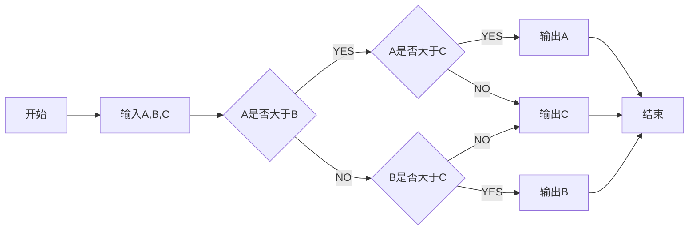

图的绘制

流程图，时序图，甘特图

### 1.flow

我们知道，流程图有几个元素：

- strat：开始框

- operation：处理框

- condition：判断框

- inputoutput：输入输出框

- end：结束框

- subroutine：子流程

- 其中，方向有以下四种

  ```swift
  (top)
  (bottom)
  (right)
  (left)
  ```
  用法：

  ```如下
  st=>start: Start
  e=>end
  op=>operation: My Operation
  cond=>condition: Yes or No?
  
  st->op->cond
  cond(yes)->e
  cond(no)->op
  ```

  <font color="red">注意：如start：start中间的“: ”为一个冒号一个空格</font>


```flow
st=>start: Start
e=>end
op=>operation: My Operation
cond=>condition: Yes or No?

st->op->cond
cond(yes)->e
cond(no)->op
```

```flow
st=>start: n=100
cdt1=>condition: n≤200
cdt2=>condition: n能被3整除
out=>inputoutput: 输出n
op=>operation: n=n+1
end=>end: 结束

st->cdt1
cdt1(yes)->cdt2
cdt1(no)->end
cdt2(yes)->op
cdt2(no)->out

out(bottom)->op
op(left)->cdt1

```
### 2. sequence

### 3. mermaid

#### 流程图方向有下面几个值

- TB 从上到下
- BT 从下到上
- RL 从右到左
- LR 从左到右
- TD 同TB

#### 基本图形

- id + [文字描述]矩形

- id + (文字描述)圆角矩形

- id + >文字描述]不对称的矩形

- id + {文字描述}菱形

- id + ((文字描述))圆形

  ```mermaid
  graph TB
      subgraph for
      a1-->a2
      end
      subgraph two
      b1-->b2
      end
      subgraph three
      c1-->c2
      end
    c1-->a2
  ```

#### 节点之间的连接

  - A --> B A带箭头指向B
  - A --- B A不带箭头指向B
  -  A -.- B A用虚线指向B
  -  A -.-> B A用带箭头的虚线指向B
  -  A ==> B A用加粗的箭头指向B
  -  A -- 描述 --- B A不带箭头指向B并在中间加上文字描述
  -  A -- 描述 --> B A带箭头指向B并在中间加上文字描述
  -  A -. 描述 .-> B A用带箭头的虚线指向B并在中间加上文字描述
  -  A == 描述 ==> B A用加粗的箭头指向B并在中间加上文字描述




